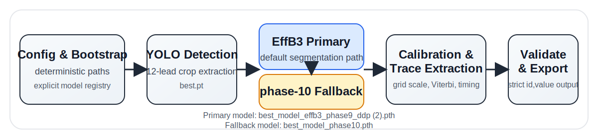

# Medical ECG Image-to-Signal Reconstruction Pipeline

Medical ECG Image-to-Signal Reconstruction Pipeline is a production-oriented refactor of a long-running ECG image digitization project. The repository presents one coherent runtime system for converting scanned or photographed 12-lead ECG sheets into structured digital waveforms, with provenance and research history preserved in archive-only areas.

## Overview

The maintained codebase focuses on a single inference pipeline:

1. deterministic config loading
2. YOLO-based lead detection
3. EfficientNet-B3 U-Net segmentation as the primary path
4. phase-10 ResNet50 U-Net as the explicit fallback path
5. calibration, trace extraction, timing normalization, and strict export validation

The public surface of the repository is intentionally centered on the final runtime system, not on the notebook history that produced it.



## Why It Matters

Digitizing ECG images into waveform arrays is useful when legacy ECGs exist only as page images, PDFs, screenshots, or scanned printouts. A robust reconstruction pipeline can support downstream review, signal analytics, quality-control tooling, and migration from image-first archives to structured biomedical data workflows.

## Final Runtime Architecture

- `src/ecg_digitizer/config`: typed runtime configuration and deterministic path resolution
- `src/ecg_digitizer/models`: model registry, explicit selector, YOLO detector, segmentation loaders
- `src/ecg_digitizer/runtime`: inference orchestration and bootstrap validation
- `src/ecg_digitizer/preprocessing`: image loading and grid-light suppression
- `src/ecg_digitizer/calibration`: grid-spacing estimation and amplitude calibration
- `src/ecg_digitizer/extraction`: Viterbi-based trace extraction and probability-mask processing
- `src/ecg_digitizer/postprocessing`: filtering, resampling, and waveform consistency fixes
- `src/ecg_digitizer/validation`: strict submission validation
- `src/ecg_digitizer/submission_export`: deterministic CSV export

## Structural Anchor vs Performance Anchor

The repository uses a deliberate dual-anchor refactor.

- Structural anchor: version `57` / notebook `(56)` supplies module boundaries, execution flow, and separation of responsibilities.
- Performance anchor: version `50` / notebook `(49)` supplies the primary runtime behavior.
- Secondary performance reference: version `46` / notebook `(45)` remains the score-proven fallback behavioral reference.

This means the package structure follows the modular late notebook line, while the runtime-critical behavior stays frozen to the score-proven compact line.

## Model Policy

- Detector: `models/best.pt`
- Primary segmentation model: `models/best_model_effb3_phase9_ddp (2).pth`
- Fallback segmentation model: `models/best_model_phase10.pth`
- Model selection is explicit and config-driven.
- Notebook-style checkpoint auto-discovery is forbidden in core runtime.

## Project Structure

```text
.
|-- configs/
|-- data/
|-- docs/
|   |-- build_notes/
|   |-- evolution/
|   `-- refactor_planning/
|-- models/
|-- results/
|-- src/ecg_digitizer/
|-- tests/
|-- tools/debug/
|-- research/training/
`-- archive/
```

## Installation

Runtime install:

```bash
make install
```

Development install:

```bash
make install-dev
```

The default runtime dependencies are listed in `requirements.txt`. Development tooling such as `pytest` and `ruff` lives in `requirements-dev.txt`.

## Quick Start

1. The repository already tracks the default frozen runtime checkpoints under `models/`. Replace them only if you are intentionally overriding the release model policy.
2. Place ECG images and competition-style metadata under your configured data root. Input data itself is not tracked in version control.
3. Review `configs/runtime.default.yaml` and adjust paths if needed.
4. Run inference:

```bash
ecg-digitizer run --config configs/runtime.default.yaml
```

5. Validate the resulting submission:

```bash
ecg-digitizer validate --config configs/runtime.default.yaml --submission results/submission.csv
```

## Python API

```python
from ecg_digitizer import load_config, run_inference

config = load_config("configs/runtime.default.yaml")
submission_path = run_inference(config)
print(submission_path)
```

## How Inference Works

The inference runner reads the template IDs from the configured sample submission file, infers per-patient waveform lengths, indexes available ECG images, resolves each patient image deterministically, detects lead crops with YOLO, extracts lead waveforms with the primary segmenter, optionally applies fallback assistance from the phase-10 model, calibrates amplitudes using grid cues, resamples outputs to the required length, and writes a strict `id,value` submission file.

## Debug Tooling

`tools/debug/` contains opt-in inspection utilities, including:

- renderer-backed signal sheet inspection
- waveform overlay generation
- PID/image coverage diagnostics
- primary-vs-fallback comparison helpers

These tools are intentionally outside the core runtime path.

## Archive and Provenance

Historical notebooks, non-core checkpoints, and the full Phase 1 audit bundle are preserved under `archive/`. They remain available for provenance and research review, but they do not define the public identity of the repository.

## Limitations

- Exact competition score values were not preserved in the local score registry snapshot, so the runtime is frozen against the known best-performing lineage without publishing unsupported numeric claims.
- Late-stage filtering and some signal-polish heuristics still contain historical uncertainty and may evolve with future validation.
- The maintained runtime assumes the target problem matches the competition-style `id,value` waveform export format.

## Future Work

- tighten the fallback quality gate with a dedicated evaluation set
- add richer dataset adapters beyond the competition-style template
- harden debug visualization around failure triage and calibration review
- expand research training support without letting it dominate the maintained runtime path

## ECG Research Workbench Seed

This repository includes an ECG Research Workbench Seed. It does not modify
the core runtime and requires no model weights or real ECG data to use.

- **Parametric synthetic ECG-like benchmark** — generates 5–10 synthetic 12-lead
  cases with ground-truth waveforms, ECG-paper-style images, and six controlled
  distortion variants (clean, blur, noise, low contrast, rotation, cropped).
  All cases are explicitly labeled `SYNTHETIC`.
- **Synthetic-only scoring utility** — computes MAE, RMSE, and an SNR-proxy
  score against known ground-truth waveforms. Not a clinical accuracy measure.
- **Engineering quality-control checks** — detects NaN/Inf values, all-zero
  signals, flatlines, amplitude anomalies, and length inconsistencies, with
  Markdown report output.
- **Failure mode atlas** — structured documentation of 8 failure categories
  (low contrast, rotation, blur, cropping, grid weakness, overlapping leads,
  flatline extraction, calibration ambiguity).
- **Academic research brief** — concise academic brief covering problem, pipeline,
  workbench contribution, limitations, and future research directions.

See `docs/research_pack/` and `tools/synthetic_benchmark/` for details.

### Pipeline Compatibility Max Pass

The repository also includes a compatibility layer that bridges the synthetic
benchmark with the full runtime pipeline. It operates on synthetic fixtures only
and makes no clinical or performance claims.

- **Asset readiness inspector** — checks whether all required configs, model
  checkpoints, and data files are present before attempting execution.
- **Synthetic runtime fixture adapter** — prepares a minimal runtime-compatible
  fixture from synthetic benchmark cases; isolated from real data directories.
- **Optional full-pipeline smoke test** — attempts a limited runtime invocation
  on synthetic fixtures; skips honestly with explicit reasons if assets are absent.
- **Honest skip reports** — every skip reason is listed explicitly in JSON and
  Markdown reports; nothing is hidden.
- **Synthetic-only boundaries** — all outputs are labeled `SYNTHETIC_COMPATIBILITY_ONLY`;
  no performance or diagnostic claims are made.

See `tools/pipeline_compat/` and `docs/research_pack/ECG_PIPELINE_COMPATIBILITY_RUNBOOK.md`.

## License

This project is released under the MIT License. See [LICENSE](LICENSE).

